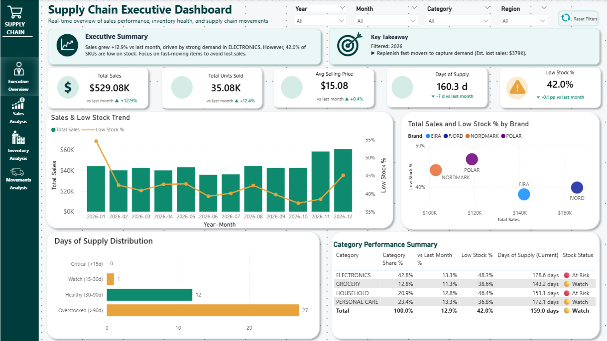
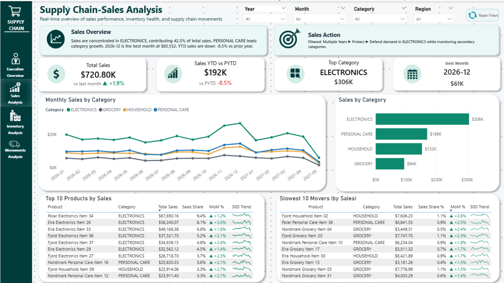
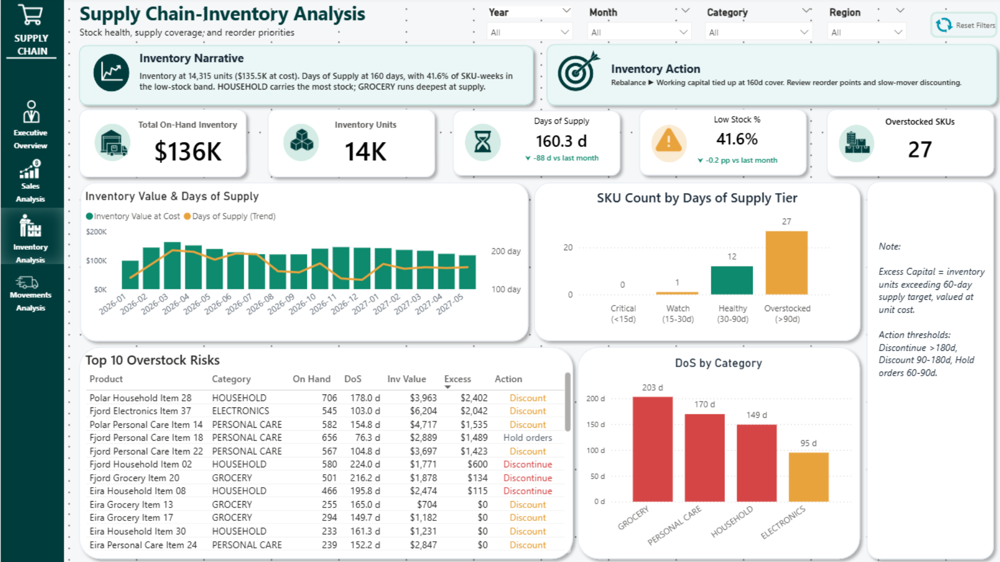
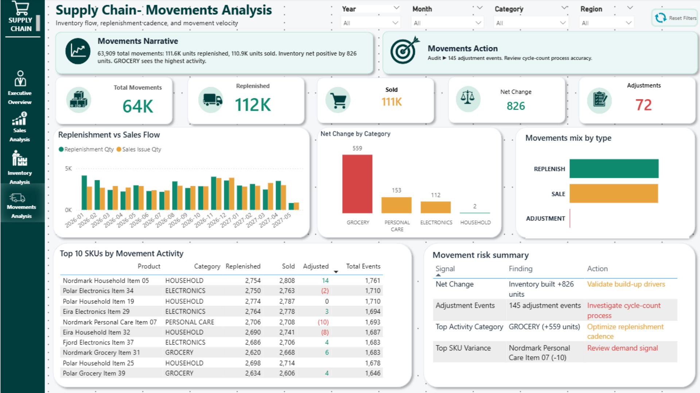
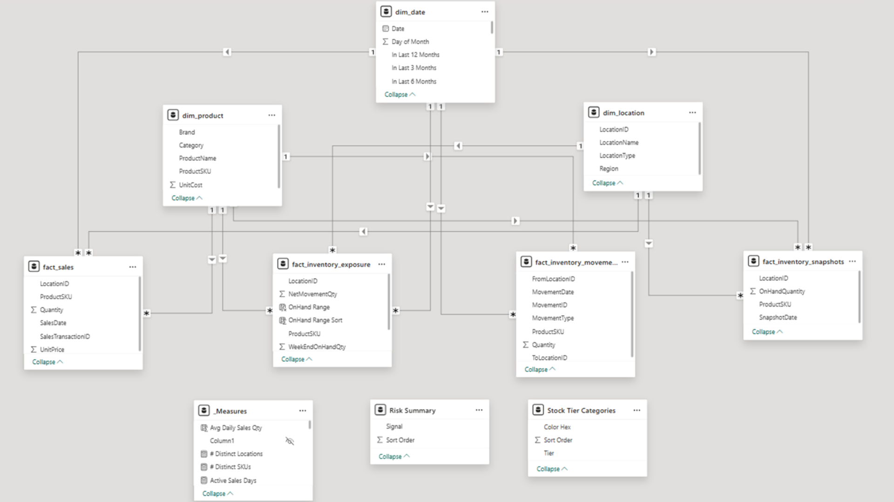

# Supply Chain Analytics Dashboard

**Turning inventory data into executive action.**

An end-to-end BI case study for a mid-size omnichannel retailer, built from raw sales, inventory, and movement data into a Power BI executive dashboard, Kimball-style analytical model, and leadership-ready findings deck.

The key finding: the business did **not** have a stockout problem. It had an **overstock problem**.

- **24 of 40 SKUs** were overstocked above 90 days of cover
- **~$95K** of working capital was trapped in slow-moving inventory
- Only **1 SKU** was at genuine stockout risk
- Recommended action: pause excess replenishment, mark down slow movers, protect fast movers, and audit adjustment events

---

## Executive Snapshot

| Area | Result |
|---|---|
| Business Problem | Operations suspected stockouts; Finance suspected overbuying |
| Main Finding | Overstock was the dominant risk, not stockout |
| Inventory Exposure | ~$95K working capital trapped in slow-moving SKUs |
| Stock Risk | 24 of 40 SKUs over 90 days cover; only 1 SKU at genuine stockout risk |
| Recommended Plan | 90-day inventory rebalancing program |
| Estimated Recovery | $50K–$70K directional recovery opportunity |
| Tools Used | Python, DuckDB, Parquet, SQL, Power BI, DAX, PowerPoint |

---

## Dashboard Preview

| Executive Overview | Sales Analysis |
|---|---|
|  |  |

| Inventory Analysis | Movements Analysis |
|---|---|
|  |  |

---

## Business Problem

A mid-size omnichannel retailer had a disagreement between teams:

- **Operations** saw occasional empty shelves and believed stockouts were costing sales.
- **Finance** saw inventory value rising faster than revenue and suspected overbuying.
- **Merchandising** wanted more SKU coverage, while **Logistics** wanted fewer slow-moving items.
- **Leadership** needed one analytical baseline to resolve the disagreement.

The goal was not just to build another dashboard. The goal was to answer:

1. Where is demand actually concentrated?
2. Where is inventory under-positioned or over-positioned?
3. Are replenishment flows aligned with sell-through?
4. Where is working capital trapped, and what action should be taken?

Full write-up: [`docs/01-business-context.md`](docs/01-business-context.md)

---

## Key Findings

### 1. Demand is concentrated, not completely failing

Total sales reached **$715K**, down **-11.3% YoY**. Electronics generated **42% of total revenue** or approximately **$304K**, creating single-category dependency risk.

The issue was not a total demand collapse. The bigger risk was that revenue depended heavily on one category, while secondary categories were not strong enough to absorb a slowdown.

---

### 2. Inventory is over-positioned across the network

The dashboard surfaced an average of **161 days of supply**, well above a healthy operating range.

The original logic flagged many SKUs as low-stock, but after cross-checking inventory levels against sales velocity, the stronger finding was that **24 of 40 SKUs were overstocked above 90 days of cover**.

This shifted the business conversation from:

> “What should we reorder?”

to:

> “Where is cash trapped, and what should we stop buying?”

---

### 3. Movement flows are functional, but data quality needs monitoring

The network processed approximately **64K inventory movement events**, including replenishments, sales, and adjustments.

Movement flow was broadly functional:

- Replenished units: approximately **112K**
- Sold units: approximately **111K**
- Net inventory change: **+826 units**

However, **145 adjustment events** were flagged for audit. This is not necessarily a crisis, but it is an early data quality signal that should be monitored before it grows into a larger inventory accuracy problem.

---

### 4. The business reframe: overstock, not stockout

The project’s main value came from reframing the analytical lens.

The original dashboard direction focused on **reorder priorities**, which implied that the business needed to order more inventory to prevent stockouts.

After comparing stock levels against sales velocity, the analysis showed the opposite:

- Only **1 SKU** was at genuine stockout risk
- **24 SKUs** were overstocked
- The stronger action was to recover trapped capital, not increase replenishment

The dashboard was reframed from **Top 10 Reorder Priorities** to **Top 10 Overstock Risks**, which became the project’s main decision-support insight.

---

## Recommended Actions

| Condition | Recommended Action | Business Purpose |
|---|---|---|
| DoS > 180 days | Liquidate / Discontinue | Remove deeply overstocked SKUs |
| DoS 90–180 days with velocity | Markdown / Promo Clearance | Convert slow-moving stock into cash |
| DoS 60–90 days | Pause Replenishment | Prevent additional overbuying |
| DoS < 14 days | Expedite Replenishment | Protect service levels on fast movers |
| Repeat manual adjustments | Cycle Count Audit | Improve inventory accuracy |

The dashboard redirects the conversation from **ordering more inventory** to **recovering trapped capital while protecting high-velocity SKUs**.

---

## Solution Architecture

The project follows a four-layer BI architecture:

```text
Raw Sources
→ Bronze: raw ingest
→ Silver: cleaned and validated data
→ Gold: Kimball-style dimensional model
→ Power BI: semantic model, DAX measures, dashboard, executive briefing
```

### Pipeline Overview

| Layer | Purpose |
|---|---|
| Raw Sources | Sales transactions, inventory snapshots, movement events, product master, location master |
| Bronze | Raw landing zone with minimal transformation |
| Silver | Cleaned and validated data with date parsing, referential checks, and movement-type normalization |
| Gold | Business-ready dimensional model exported as Parquet |
| Power BI | Semantic layer, DAX measures, dashboard pages, and executive storytelling |

Full write-up: [`docs/02-architecture.md`](docs/02-architecture.md)

---

## Data Model

The Power BI model uses shared Product, Date, and Location dimensions across sales, inventory snapshots, movement events, and inventory exposure fact tables.

> Add your model view screenshot here after uploading it to the `screenshots/` folder.

```markdown

```

| Table Type | Tables |
|---|---|
| Dimensions | `dim_product`, `dim_date`, `dim_location` |
| Facts | `fact_sales`, `fact_inventory_snapshots`, `fact_inventory_movements`, `fact_inventory_exposure` |
| Helper / Semantic Tables | `_Measures`, `Risk Summary`, `Stock Tier Categories` |

The model supports sales analysis, inventory health monitoring, movement flow analysis, Days of Supply logic, and SKU-level action recommendations.

Full documentation: [`docs/03-data-model.md`](docs/03-data-model.md)

---

## Power BI Dashboard Pages

| Page | Audience | Main Question |
|---|---|---|
| Executive Overview | Leadership / Weekly Review | What is the overall business risk? |
| Sales Analysis | Commercial / Merchandising | Which products and categories drive revenue? |
| Inventory Analysis | Inventory Planning / Finance | Where is cash trapped? |
| Movements Analysis | Operations / Logistics | Is replenishment aligned with demand? |

Each page follows a consistent structure:

```text
Filters
→ Narrative band
→ KPI strip
→ Primary analysis visuals
→ SKU-level or action-level detail
```

The narrative and action bands are filter-aware, meaning the text updates based on the selected year, month, category, or region.

---

## Technical Highlights

- Built a medallion-style pipeline from raw operational files into dashboard-ready tables
- Modeled the data using a Kimball-style star schema
- Created a Power BI semantic layer with **14 tables**, **109 columns**, and **101 DAX measures**
- Organized measures into business-friendly display folders
- Built filter-aware narrative measures for executive summaries and action prompts
- Implemented Days of Supply logic using sales velocity
- Created SKU-level action rules for markdown, liquidation, replenishment pause, and audit recommendations
- Packaged the analysis into both a technical case study deck and an executive briefing deck

DAX examples: [`docs/04-dax-highlights.md`](docs/04-dax-highlights.md)

---

## Repository Structure

```text
supply-chain-analytics-dashboard/
│
├── README.md
├── LICENSE
├── .gitignore
│
├── docs/
│   ├── 01-business-context.md
│   ├── 02-architecture.md
│   ├── 03-data-model.md
│   └── 04-dax-highlights.md
│
├── pipeline/
│   ├── README.md
│   ├── bronze/
│   ├── silver/
│   └── gold/
│       ├── export_gold_to_parquet.py
│       └── gold__adv_fact_inventory_exposure.py
│
├── data/
│   └── README.md
│
├── pbix/
│   └── supply_chain_analytics.pbix
│
├── screenshots/
│   ├── 01-executive-overview.png
│   ├── 02-sales-analysis.png
│   ├── 03-inventory-analysis.png
│   ├── 04-movements-analysis.png
│   └── 05-data-model.png
│
└── reports/
    ├── case-study-deck.pptx
    └── executive-briefing.pptx
```

---

## How to Review This Project

If you are reviewing this project for a BI Analyst, Data Analyst, Reporting Analyst, or Power BI Developer role, start here:

1. Read the executive snapshot in this README.
2. View the dashboard screenshots in [`screenshots/`](screenshots/).
3. Open the Power BI file in [`pbix/`](pbix/).
4. Review the case study deck in [`reports/case-study-deck.pptx`](reports/case-study-deck.pptx).
5. Review the executive briefing in [`reports/executive-briefing.pptx`](reports/executive-briefing.pptx).
6. Inspect the architecture and data model documentation in [`docs/`](docs/).
7. Review the pipeline scripts in [`pipeline/`](pipeline/).

---

## Project Outputs

| Output | Location | Audience |
|---|---|---|
| Power BI dashboard | `pbix/` and `screenshots/` | Operations, Inventory Planning, Finance |
| Case study deck | `reports/case-study-deck.pptx` | Hiring managers and technical reviewers |
| Executive briefing deck | `reports/executive-briefing.pptx` | Leadership and business stakeholders |
| Data model documentation | `docs/03-data-model.md` | Senior analysts and BI developers |
| DAX highlights | `docs/04-dax-highlights.md` | Power BI reviewers |
| Pipeline scripts | `pipeline/` | Technical reviewers |

---

## Tech Stack

| Layer | Tools |
|---|---|
| Storage | DuckDB, Parquet |
| Pipeline | Python, pandas, pyarrow, SQL |
| Modeling | Kimball-style star schema |
| Semantic Layer | Power BI Desktop, DAX |
| Visualization | Power BI |
| Reporting | PowerPoint |
| Version Control | Git, GitHub |

---

## About the Dataset

This is a standalone portfolio case study using a representative retail supply chain dataset. The data is synthetic, but designed to mirror the structure, scale, and messiness of real retail operations.

The dataset covers **December 2025 through May 2027** and includes:

- Approximately **57K sales transactions**
- Approximately **17K daily inventory snapshots**
- Approximately **64K inventory movement events**
- 40 SKUs across Electronics, Grocery, Household, and Personal Care
- Multiple locations across stores, distribution centers, and web operations

The analysis, modeling, dashboarding, and storytelling were completed end-to-end as original portfolio work.

---

## Assumptions & Limitations

- This is a portfolio case study using synthetic retail supply chain data.
- Financial impact values are directional estimates, not audited financial results.
- The 60-day coverage benchmark is used as a default planning assumption.
- The $50K–$70K recovery estimate assumes 50%–70% monetization of excess inventory through markdowns and replenishment avoidance.
- A production version would include live warehouse refresh, row-level security, automated alerts, and category-specific inventory targets.
- Holding cost, recovery rate, and replenishment targets should be validated with actual Finance, Merchandising, and Inventory Planning teams before production use.

---

## What This Project Demonstrates

This project demonstrates my ability to:

- Translate a business disagreement into measurable analytical questions
- Build a structured BI pipeline from raw files to reporting-ready outputs
- Design a dimensional model for sales, inventory, and movement analysis
- Create Power BI dashboards that support operational decisions
- Write DAX measures for KPIs, narratives, Days of Supply, and action logic
- Communicate findings through both technical documentation and executive storytelling

---

## Contact

**Erwin Glenn L. Capitan II**  
BI Analyst / Power BI Developer

- LinkedIn: [linkedin.com/in/erwin-glenn-capitan-ii](https://www.linkedin.com/in/erwin-glenn-capitan-ii/)
- Email: glcapitan007@gmail.com
- GitHub: [github.com/glcapitan](https://github.com/glcapitan)

---

*This project was built as a standalone portfolio case demonstrating end-to-end supply chain analytics capability — from business context and data modeling to Power BI dashboarding, DAX, executive storytelling, and business action planning.*
